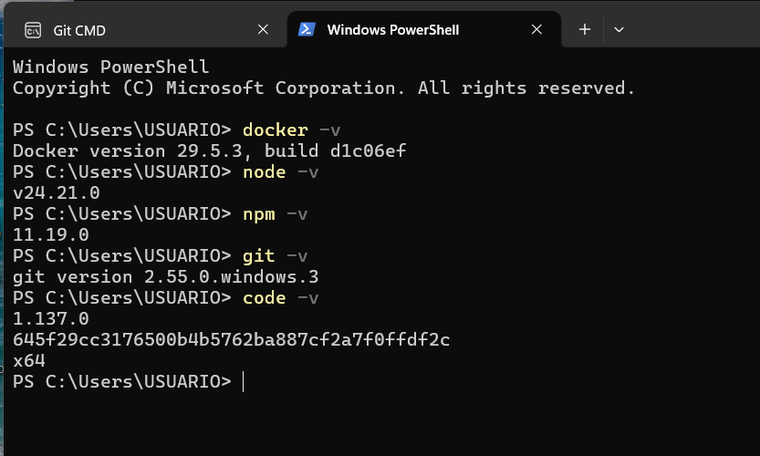
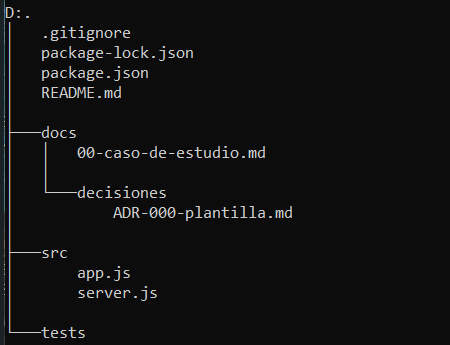

# Guía 01 - Arquitectura de Software

Repositorio de la primera práctica del curso de Arquitectura de Software, orientada a configurar el entorno de desarrollo y organizar la estructura inicial de un proyecto.

## 1. Información general

- **Estudiante:** CAMPOS PORRAS, FRANK CRISMAR
- **Código de estudiante:** 27210131
- **Curso:** Arquitectura de Software
- **Código del curso:** IS-488
- **Docente:** Ing. Lizeth Jaico Quispe
- **Universidad:** Universidad Nacional de San Cristóbal de Huamanga
- **Escuela Profesional:** Ingeniería de Sistemas

## 2. Breve descripción del curso

El curso de Arquitectura de Software aborda los fundamentos para diseñar y organizar sistemas mediante componentes con responsabilidades definidas. Se estudian principios, patrones y decisiones arquitectónicas que contribuyen a la calidad, el mantenimiento y la evolución del software.

En esta práctica se verifica el entorno de desarrollo, se configura la identidad en Git y se prepara un proyecto con Node.js, Express y Nodemon. Asimismo, se organiza la documentación y se introduce el trabajo colaborativo mediante el control de versiones.

## 3. Expectativas respecto al curso

Espero aprender a analizar las necesidades de un sistema y proponer una arquitectura adecuada, considerando su funcionamiento, mantenimiento y posibilidad de crecimiento.

También busco fortalecer mis habilidades para organizar el código, separar responsabilidades y documentar las decisiones técnicas de un proyecto. Me interesa aplicar estos conocimientos en el desarrollo de soluciones relacionadas con la gestión de datos y la seguridad informática.

Finalmente, espero mejorar el uso de Git y la colaboración en equipo, manteniendo un registro ordenado de los cambios y aportes realizados.

## 4. Evidencias de los pasos 1 y 2

### Paso 1: Verificación del entorno de desarrollo

Se ejecutaron los comandos de verificación para registrar las versiones instaladas de las herramientas del laboratorio.

| Herramienta | Comando de verificación | Versión instalada |
| :--- | :--- | :--- |
| Node.js | `node --version` | v25.8.0 |
| npm | `npm --version` | 11.11.0 |
| Git | `git --version` | 2.50.1 |
| Visual Studio Code | `code --version` | [Completar con la versión instalada] |
| Docker | `docker --version` | 29.3.1 |

**Observación:** la guía indica Node.js 20.x y npm 10.x. Las versiones registradas corresponden al equipo utilizado y difieren de las señaladas.

#### Captura de verificación de versiones



### Paso 2: Configuración de la identidad en Git

Este paso consiste en configurar el nombre completo del estudiante, el correo institucional y la rama predeterminada `main`. Estos datos permiten identificar la autoría de los commits del repositorio.

- **Nombre:** CAMPOS PORRAS, FRANK CRISMAR
- **Correo institucional:** [Completar con el correo institucional configurado]
- **Rama predeterminada:** main

#### Captura de configuración de Git

[Agregar la captura de la configuración de Git cuando esté disponible.]

## 5. Creación del proyecto y estructura base

El proyecto organiza la documentación, el código fuente y las pruebas en carpetas independientes, de acuerdo con la estructura solicitada en la guía.

```text
guia-01-arqSoftware-FrankCampos/
├── docs/
│   ├── 00-caso-de-estudio.md
│   ├── decisiones/
│   │   └── ADR-000-plantilla.md
│   └── imagenes/
│       ├── Versiones.png
│       └── Estructura.png
├── src/
│   ├── app.js
│   └── server.js
├── tests/
├── .gitignore
├── README.md
├── package.json
└── package-lock.json
```

La carpeta `docs/imagenes/` se incorpora para almacenar las capturas utilizadas en este documento.

### Captura de la estructura del proyecto

